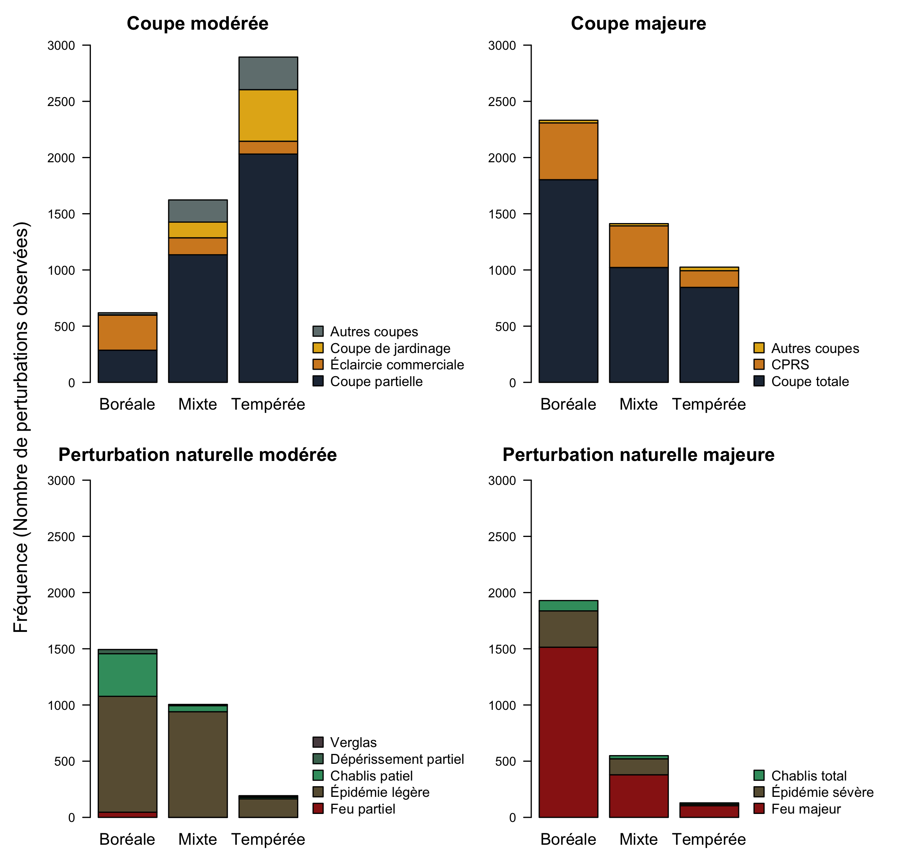
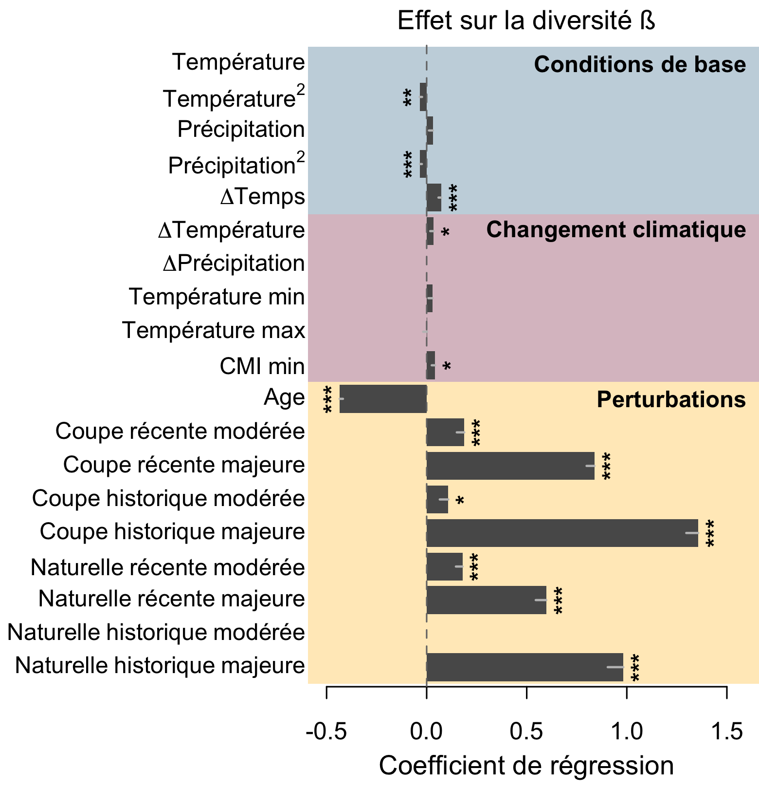
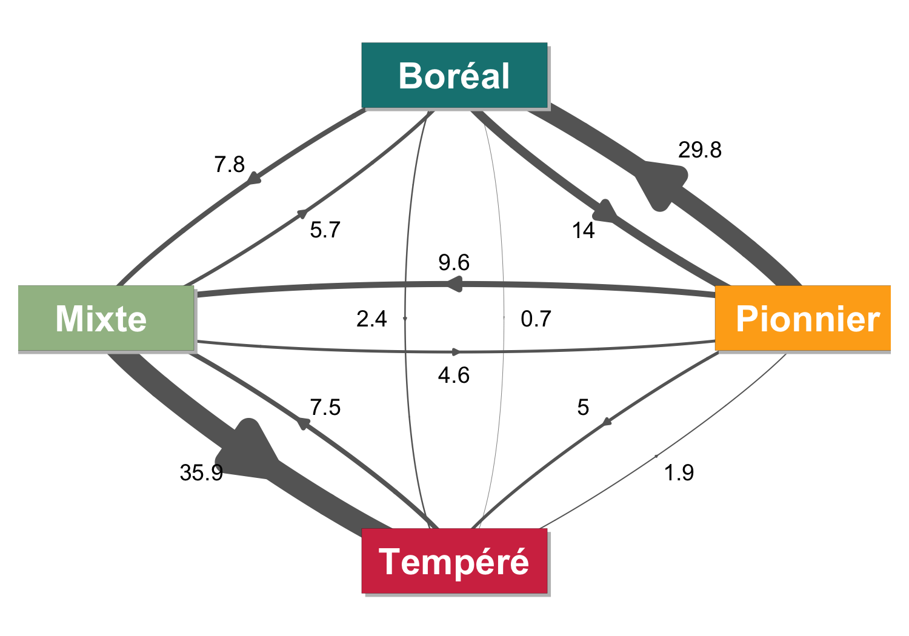
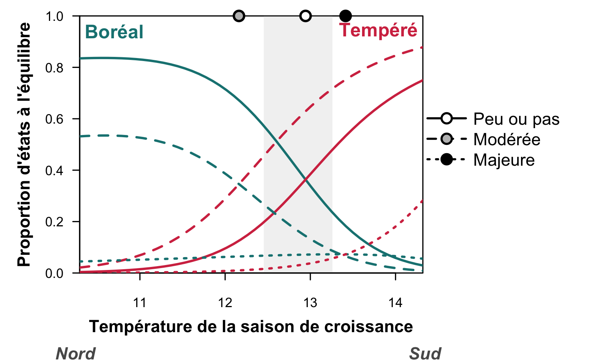
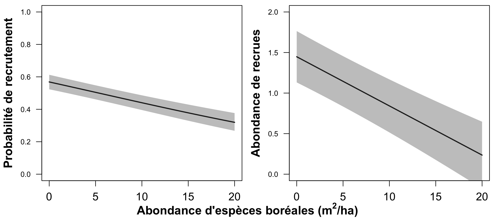

```{r setup, echo = FALSE}
knitr::opts_chunk$set(
  comment = "#",
  collapse = TRUE,
  warning = FALSE,
  message = FALSE,
  echo = FALSE,
  fig.width=5, fig.height=5,
  fig.align = 'center',
  fig.retina = 3
)
```

```{r library, include = FALSE}
library(graphicsutils)
library(diagram)
library(dplyr)
library(latex2exp)
library(scales)
library(performance)
library(graphicsutils)
library(countreg)
library(sf)
source("funs.R")
```

## À propos de moi

**Formation**

- Doctorat en écologie forestière sous la direction de Pierre Legendre (UdeM) et Marie-Josée Fortin (UofT)
  - Thèse: [*Dynamique spatio-temporelle des forêts dans l’écotone boréal-tempéré en réponse aux changements globaux*](https://github.com/mhBrice/thesis/blob/master/Brice_Marie-Helene_2020_these.pdf)
  
- Maîtrise en écologie urbaine sous la direction de Stéphanie Pellerin (IRBV) et Monique Poulin (ULaval)
  - Mémoire: [*Impact de l'urbanisation sur la diversité spécifique et fonctionnelle dans les forêts riveraines*](https://papyrus.bib.umontreal.ca/xmlui/handle/1866/13639)

**À venir**

- Post-doc avec Yan Boucher (MFFP) et Yves Bergeron (UQAT)

---
## Changement climatique 

<br>

```{r}
x <- data.frame('',
           '')
knitr::kable(x, format = "html", col.names = NULL)
```


.footnote[IPCC Fifth Assessment Report. 2014]

---
## Changement climatique 

<br>

```{r}
x <- data.frame('',
           '')
knitr::kable(x, format = "html", col.names = NULL)
```


.footnote[Données bioclimatiques de Ressources naturelles Canada https://cfs.nrcan.gc.ca/projects/3/9]

---
## Déplacement des niches climatiques 

Future enveloppe climatique de l'Érable à sucre (2071-2100)

.center[

]

.footnote[McKenney et al. 2007. BioScience.]

---
## Contraintes à la migration 

- Longue vie et reproduction tardive
- Dispersion limitée
- Hétérogénéité du sol
- Compétition interspécifique


.center[]

---
## Et les perturbations? 

<br>


---
## États alternatifs stables 

<br>

.center[
]

.footnote[Johnstone et al. 2016. Frontiers in Ecology and the Environment.]


---
## bjectifs de la thèse 

**Comprendre et quantifier l'influence du climat et des perturbations sur les changements dans les communautés forestières selon 3 points de vue différents : **

<br>


---
## Hypothèses  

Dynamique forestière attendue à l'écotone boréal-tempéré sous l'effet...

.center[

]
--
.center[

]
--
.center[

]


---
## Données des inventaires forestiers 

Inventaires forestiers du Québec Méridional 	
  .small[- 12000+ placettes-échantillon permanentes échantillonnées durant 5 grands inventaires entre 1970 et 2018 (par le MFFPQ)]


.center[

]

---
## Les forêts du Québec 


.pull-left2[
<br>

]

.pull-right2[


]

<!--- Présenter les grands groupes d'arbres
- Gradient climatique au québec
- Écotone
- Perturbation-->

---
## Les forêts du Québec 


```{r, fig.align='center'}
library(kableExtra)
x <- data.frame('',
           '')
knitr::kable(x, format = "html", col.names = NULL)
```


---

class: inverse, center, middle

# Chapitre 1

### Changements de composition des forêts


#### 


<br><br><br>
<span style="color: #f3f3f3; background-color:#134f0180;">Brice, M.-H., Cazelles, K., Legendre, P., & Fortin, M.-J. (2019). Disturbances amplify tree community responses to climate change in the temperate–boreal ecotone. Global Ecology and Biogeography, 28(11), 1668–1681. </span>


---
## bjectifs du chapitre 1 

**Quelles sont les contributions relatives du réchauffement climatique et des perturbations aux changements dans la composition des forêts?**

<br>

> .image-holder[ ] Quels sont les principaux moteurs des changements des communautés forestières au cours des dernières décennies?
>
> .image-holder[ ] Les communautés forestières ont-elles subi une thermophilisation au cours des dernières décennies?
>
>.image-holder[ ] Quelles espèces d'arbres contribuent aux changements de composition?


---
## Diversité ß temporelle 

<br>

.center[
]


---
## Quels facteurs influencent la diversité ß? 


```{r, fig.align='center'}
library(kableExtra)
x <- data.frame('',
           '')
knitr::kable(x, format = "html", col.names = NULL)
```


---
## Thermophilisation des communautés 

.center[

]

.footnote[Schéma inspiré de Bertrand et al. 2011]


---
## Thermophilisation des communautés 

- La thermophilisation est généralement positive partout au Québec
- La thermophilisation est plus grande après perturbations modérées

.center[

]
---
## Thermophilisation des communautés 

<br>


.center[

]

La thermophilisation est plus forte et s'étend plus au nord dans les communautés modérément perturbées que dans celles qui ont été peu perturbées ou sévérement perturbées


---
## Thermophilisation des communautés 


.center[

]

---
## Message clé 

<br>


---
class: inverse, center, middle

# Chapitre 2

### Dynamique de transition des forêts


#### 


<br><br><br>
<span style="color: #f3f3f3; background-color:#134f0180;">Brice, M.-H., Vissault, S., Vieira, W., Gravel, D., Legendre, P., & Fortin, M.-J. (2020). Moderate disturbances accelerate forest transition dynamics under climate change in the temperate–boreal ecotone of eastern North America. Global Change Biology, 26(8), 4418–4435.</span>

---
## bjectifs du chapitre 2 

<br>

**Comprendre les contraintes et les moteurs qui influencent la dynamique de transition des communautés forestières du Québec.**


> .image-holder[  Comment les perturbations influencent-elles les probabilités de transition entre les états forestiers ? ]
>
> .image-holder[  Quel est l'impact de différentes intensités de perturbation sur l'équilibre potentiel et la dynamique transitoire ? ]
>
> .image-holder[  Quelle est l'importance relative des processus démographiques sous-jacents à la dynamique de transition ? ]

---
## Transitions entre 4 états forestiers 

.center[

]


---
## Dynamique de transition en 4 états 

.center[

]


---
## Modèle de Markov multi-états 


.small[Nous modélisons la matrice d'intensité **Q** contenant les risques de transition instantanée entre les états (ligne à colonne) en fonction de variables environnementales.]


.center[

]


---
## Dynamique de transitions 

##### Peu ou pas de coupe

.center[

]


---
## Dynamique de transitions 

##### Coupes modérées

.center[

]

---
## Dynamique de transitions 

##### Coupes majeures

.center[

]

---
## Dynamique de transitions 

- Les coupes influencent la dynamique de transition forestière

- Les coupes modérées favorisent les transitions Mixte $\rightarrow$ Tempéré

- Les coupes majeures favorisent les transitions vers Pionnier

<br>

```{r}
x <- data.frame("Peu ou pas" = '',
           "Modérée" = '',
           "Majeure" = '')
knitr::kable(x, format = "html", col.names = c("Peu ou pas", "Modérée", "Majeure"),
             align = "c")
```


---
## Déplacement de l'écotone à l'équilibre 


##### Peu ou pas de coupe

.center[

]

---
## Déplacement de l'écotone à l'équilibre 

##### Coupes modérées
.center[

]

---
## Déplacement de l'écotone à l'équilibre 

##### Coupes majeures
.center[

]


---
## Dynamique transitoire 

Temps de séjour  temps passé dans un état avant de faire une transition

Temps de convergence  temps pour atteindre 90% de l'équilibre

.center[]

---
## Dynamique transitoire 

Temps de séjour  temps passé dans un état avant de faire une transition

Temps de convergence  temps pour atteindre 90% de l'équilibre

.center[]

---
## Dynamique transitoire 

Temps de séjour  temps passé dans un état avant de faire une transition

Temps de convergence  temps pour atteindre 90% de l'équilibre

.center[]


---
## Processus démographiques 

.center[

]

---
## Processus démographiques 

.center[

]


---
## Message clé 

<br>


---
class: inverse, center, middle

# Chapitre 3

### Recrutement des espèces tempérées

#### 

<br><br><br>
<span style="color: #f3f3f3; background-color:#134f0180;">Brice, M.-H., Chalumeau, A., Grondin, P., Fortin, M.-J. & Legendre, P. (En préparation). Northern range shifts of temperate tree saplings in Québec: the role of climate, stand composition, soils and disturbances on recruitment dynamics.</span>

---
## bjectifs du chapitre 3 

<br>

**Quels facteurs contrôlent le recrutement des espèces tempérées à la marge nord de leur distribution?**

<br>

> .image-holder[ ] Est-ce que la distribution des gaulis d'espèces tempérées s'est déplacée vers le nord?
>
> .image-holder[ ] Comment différentes intensités de perturbations influencent-elles les déplacements vers le nord des gaulis?
>
> .image-holder[ ] Comment différentes conditions biotiques et abiotiques influencent-elles le recrutement des gaulis à la limite nord de leur distribution?


---
## Données de recrutement 

<br>

```{r}
x <- data.frame('',
           '')
knitr::kable(x, format = "html", col.names = NULL)
```


<br>

.small[*Gaulis = jeunes arbres avec un diamètre entre 1 et 9 cm*]

---
## Déplacement des gaulis vers le nord 

.center[

]


---
## Déplacement des gaulis vers le nord 

##### Distribution des gaulis de *Acer rubrum*


.center[

]

---
## Déplacement des gaulis vers le nord 

##### Distribution des gaulis de *Acer rubrum*


.center[

]

.small[
Forte augmentation des occurrences, en particulier dans les sites coupés

Migration de ~20 km vers le nord quand il y a peu ou pas de coupe ou des coupes modérées 

Pas de migration quand il y a des coupes majeures.
]


---
## Quels facteurs influencent le recrutement? 


Modèle en deux parties (Hurdle) :

- un processus pour les comptages de zéros
  - Présence-absence de gaulis
  - Régression binomiale

- un processus pour les comptages positifs 
  - Abondance de gaulis
  - Régression binomiale négative tronquée


<div style = "position: absolute; top:120px; left:60%">

</div>


<br>

```{r, fig.width=6.6, fig.height=3.2}
pos <- coordinates(pos = 4)
pos[,1] <- pos[,1] + c(-.015,0.025,-.01,0)
labs <- c(expression(bold('t'[0])),
          expression(bold('t'[1])),
          expression(bold('t'["..."])),
          expression(bold('t'["n"])))
curv <- c(-0.6, -0.8, -0.7)

par(mar=c(0,0,0,0))
openplotmat(main = "")
for (i in 1:4) {
  textellipse(mid=pos[i,], radx = 0.1, lab = labs[i], cex = 2,
              col = '#404940', shadow.col='#98B283', shadow.size = 0.005)
  }
for (i in 1:3) {
  curvedarrow(from = pos[i, ] + c(.01, .12), to = pos[i+1, ] + c(-.01, .12),
              curve = curv[i], arr.type = "triangle", arr.length=.4, arr.width=.5,
              arr.pos = .5, lwd = 4, lcol ="grey40", arr.col ="grey40")}

straightarrow(from = pos[1, ] - c(0, .22), to = pos[4, ] - c(0, .22),
              arr.type = "triangle", arr.pos = 1, lwd = 15, lcol ="grey60", arr.col ="grey60",
              arr.length=.7, arr.width=.7)
textplain(pos[4, ] - c(0, .35), lab = "Temps", cex = 1.7)
textplain(pos[1, ] + c(0.15, .4), lab = "n recrues", cex = 1.3)
textplain(pos[2, ] + c(0.1, .4), lab = "n recrues", cex = 1.3)
textplain(pos[3, ] + c(0.15, .4), lab = "n recrues", cex = 1.3)
```


---
## Quels facteurs influencent le recrutement? 

.small[
**Climat**

>  Température de la saison de croissance et changement entre 1950 et 2018

>  Indice d'humidité climatique (CMI) et changement entre 1950 et 2018


**Conditions topo-édaphiques**

>  pH du sol

>  Drainage du sol

>  Position sur la pente

**Conditions biotiques**

>  Abondance d'individus de la même espèce dans la placette et dans le voisinage

>  Abondance d'espèces boréales dans la placette

**Perturbations**

>  Coupes entre $t_{i-1}$ et $t_{i}$

>  Perturbations naturelles entre $t_{i-1}$ et $t_{i}$

>  Âge du peuplement

]

---
## Quels facteurs influencent le recrutement? 

Recrutement des gaulis de *Acer rubrum* en fonction de 
- l'**abondance de *Acer rubrum* matures** (i.e., disponibilité des propagules)

<br>

.center[
 ]

---
## Quels facteurs influencent le recrutement? 

Recrutement des gaulis de *Acer rubrum* en fonction de 
- l'**abondance en espèces boréales** (i.e., effet prioritaire)

<br>

.center[
 ]


---
## Quels facteurs influencent le recrutement? 

Recrutement des gaulis de *Acer rubrum* en fonction de 
- la **qualité du drainage**

<br>

.center[
]


---
## Quels facteurs influencent le recrutement? 

Recrutement des gaulis de *Acer rubrum* en fonction de 
- la **position sur la pente**

<br>

.center[
]


---
## Quels facteurs influencent le recrutement? 

Recrutement des gaulis de *Acer rubrum* en fonction de 
- l'**intensité de coupe $\times$** l'**abondance de *Acer rubrum* matures**

<br>

.center[
 ]

---
## Quels facteurs influencent le recrutement? 

Recrutement des gaulis de *Acer rubrum* en fonction de 
- l'**intensité de perturbation naturelle $\times$** l'**abondance de *Acer rubrum* matures** 

<br>

.center[
 ]


---
## Quels facteurs influencent le recrutement? 


.center[

]

.small[
**Le recrutement de *Acer rubrum* à sa limite nord est...**


 favorisé par:
> la proximité d'arbres de la même espèce pour la dispersion;
>
> les perturbations.
>
> les sols mésiques dans les hauts de pente;

 contraint par:

> l'effet inhibiteur prioritaire du couvert en espèces boréales;
>
> les sols hydriques dans les bas de pente;

]


---
##  Message clé 


<br>


---
class: inverse, center, middle

# Conclusions et perspectives


---
## Les perturbations &mdash; catalyseurs de changements 


.center[

]

Les perturbations .alert[modérées]:

- Enlèvent une partie de la communauté en place
- Créent des ouvertures dans la canopée
- Modifient les conditions locales
- Permettent le renouvellement de la communauté

---
## Les perturbations &mdash; catalyseurs de changements 


.center[

]

Les perturbations .alert[majeures]:

- Enlèvent toute la communauté en place
- Créent des ouvertures de très grande superficie
- Modifient les conditions locales
- Favorisent la colonisation par les espèces pionnières

---
## Des changements à travers les échelles 

.center[

]

---
## États alternatifs stables 

***Sans*** changement climatique

<br>

.center[

]

---
## États alternatifs stables 

***Avec*** changement climatique

<br>

.center[

]


---
## Recherche et aménagement 

**Devrions-nous couper des arbres pour accélérer les transitions forestières ?**

.center[

]

<br>
--

Les coupes partielles pourraient

>  le crédit d'extinction des espèces boréales
>
>  la dette de colonisation des espèces tempérées
>
>  le déséquilibre entre la distribution actuelles des espèces et le climat


---
## Recherche et aménagement 

<br><br>

**Quelles sont les meilleures stratégies d'aménagement pour favoriser la capacité des écosystèmes à s'adapter aux conditions futures ?**

<br>

**Quels sont les effets de la fréquence et de la séquence des perturbations sur la dynamique des forêts ?**


<br>

**Quels sont les compromis entre l’intégrité des écosystèmes, leur capacité à s’adapter aux conditions futures, et les besoins de l’exploitation forestière ?**


---
## Recherche et aménagement 


---
class: inverse, center, middle

# Merci!

---
## Résultats des modèles de diversité ß

<br>

.center[

]

---
## Thermophilisation vs succession

<br>

.center[

]

---
## Définition des états

<br>

.center[

]


---
## Résultats du modèle mutli-état

.center[

]

---
## Résultats du modèle de recrutement

Présence de gaulis

.center[

]

---
## Résultats du modèle de recrutement

Abondance de gaulis

.center[

]
