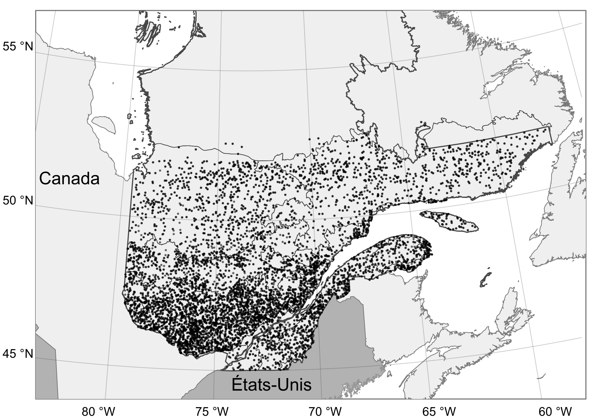
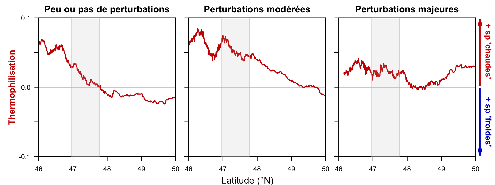
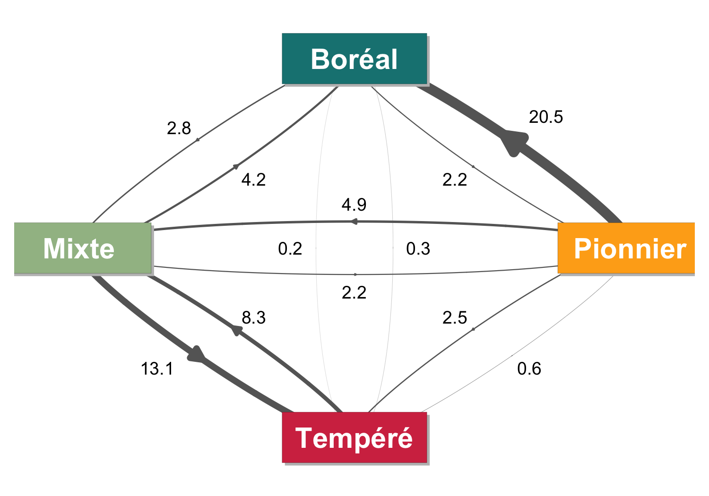
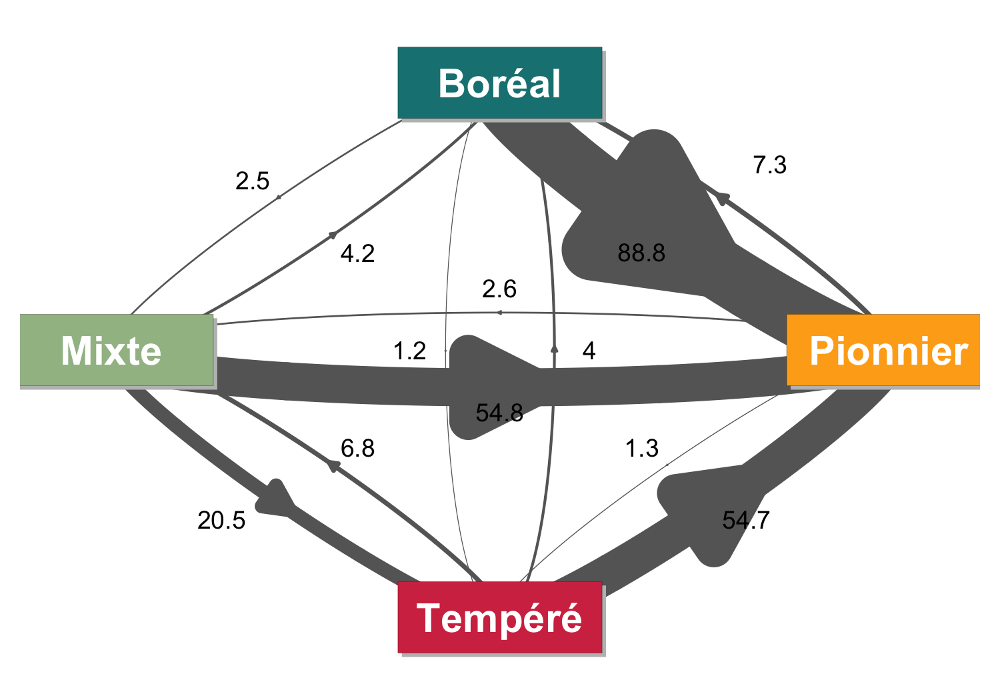
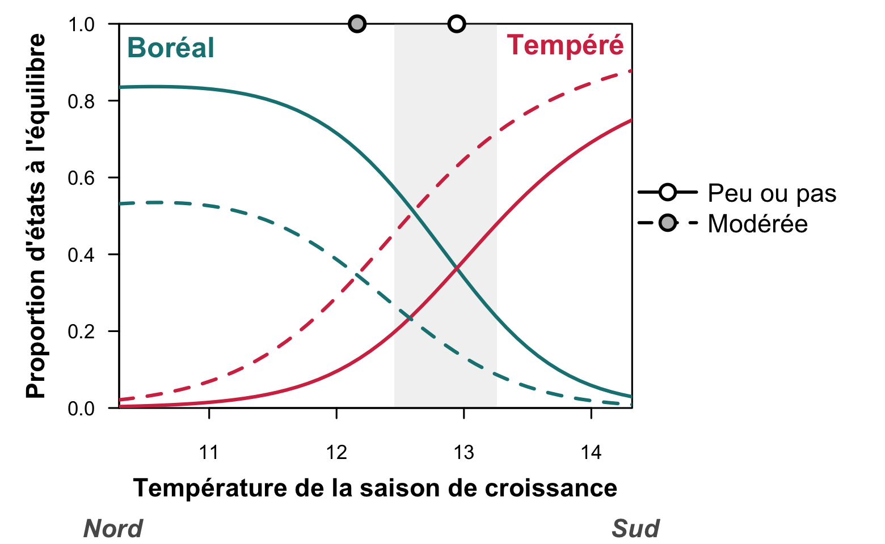
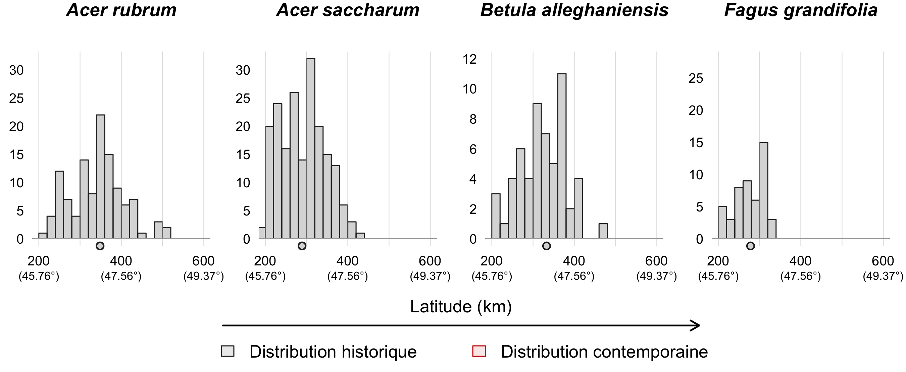
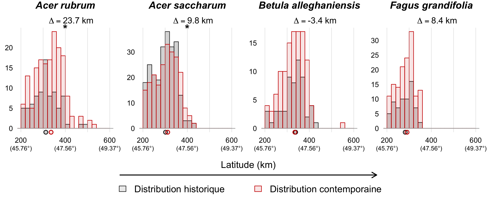
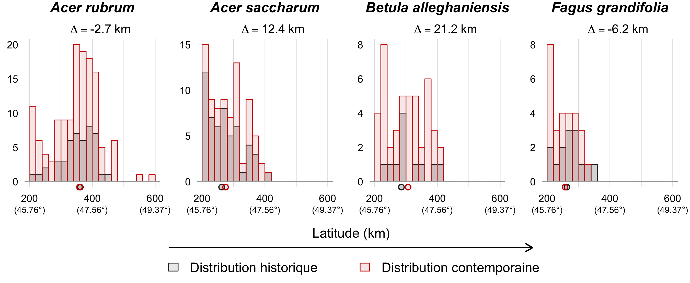

```{r setup, echo = FALSE}
knitr::opts_chunk$set(
  comment = "#",
  collapse = TRUE,
  warning = FALSE,
  message = FALSE,
  echo = FALSE,
  fig.width=5, fig.height=5,
  fig.align = 'center',
  fig.retina = 3
)
```

```{r library, include = FALSE}
library(graphicsutils)
library(diagram)
library(dplyr)
library(latex2exp)
library(scales)
library(performance)
library(graphicsutils)
library(countreg)
library(sf)
source("funs.R")
```


## Changement climatique

<br><br>

.center[
 
]


.footnote[IPCC Fifth Assessment Report. 2014]

---
## Changement climatique

.pull-left3[
<br>

]
.pull-right3[
<br><br>

]
 


---
## Déplacement des niches climatiques

Future enveloppe climatique de l'Érable à sucre (2071-2100)

.center[

]

.footnote[McKenney et al. 2007. BioScience.]

---
## Contraintes à la migration

- Démographie lente
- Dispersion limitée
- Hétérogénéité du sol
- Compétition interspécifique


.center[]

---
## États alternatifs stables

<br>

.center[
]

.footnote[Johnstone et al. 2016. Frontiers in Ecology and the Environment.]


---
## bjectifs de la thèse

**Comprendre et démêler l'influence du climat et des perturbations sur les changements dans les communautés forestières selon 3 points de vue différents : **

<br>

> **Chapitre** .image-holder[  Changements de composition des forêts avec la diversité ß temporelle et un indice de thermophilisation. ]
>
> **Chapitre** .image-holder[  Dynamique de transition des forêts en 4 états. ]
>
> **Chapitre** .image-holder[  Recrutement des espèces tempérées à leur limite nord. ]


<br>

.center[.image-holder[


]]

---
## Hypothèses

.center[

]
--
.center[

]
--
.center[

]


---
## Les forêts du Québec


.pull-left2[ 

]

.pull-right2[


]

<!--- Présenter les grands groupes d'arbres
- Gradient climatique au québec
- Écotone
- Perturbation-->

---
## Les forêts du Québec


---
## Données des inventaires forestiers

Inventaires forestiers du Québec Méridional 	
  .small[- 12000+ placettes-échantillon permanentes échantillonnées durant 5 grands inventaires entre 1970 et 2018 (par le MFFPQ)]


.center[

]


---

class: inverse, center, middle

# Chapitre 1 

### Changements de composition des forêts


#### 


<br><br><br>
<span style="color: #f3f3f3; background-color:#134f0180;">Brice, M.-H., Cazelles, K., Legendre, P., & Fortin, M.-J. (2019). Disturbances amplify tree community responses to climate change in the temperate–boreal ecotone. Global Ecology and Biogeography, 28(11), 1668–1681. </span>


---
## Diversité ß temporelle

.center[
]

---
## Diversité ß temporelle

.center[
]

---
## Diversité ß temporelle

.center[
]

---
## Diversité ß temporelle

.center[
]

---
## Moteurs de changements de la diversité

.center[
]

---
## Moteurs de changements de la diversité

.center[
]

<!--
DIAPO À FAIRE

- Coupe vs perturbation naturelle
- Récente vs historique
- Comment les perturbations influencent les pertes et les gains?
-->

---
## Thermophilisation des communautés

.center[

]

.footnote[Bertrand et al. 2011]


---
## Thermophilisation des communautés

- La thermophilisation est généralement positive partout au Québec
- La thermophilisation est plus grande après perturbations modérées

.center[

]
---
## Thermophilisation des communautés

<br>


.center[

]

La thermophilisation est plus fort et s'étend plus au nord dans les communautés modérément perturbées que dans celles qui ont été peu perturbées ou sévérement perturbées

La thermophilisation est liée au processus de succession mais ne peut être expliquée par l'augmentation des espèces pionnières. 

---
## Thermophilisation des communautés


.center[

]


---
class: inverse, center, middle

# Chapitre 2

### Dynamique de transition des forêts


#### 


<br><br><br>
<span style="color: #f3f3f3; background-color:#134f0180;">Brice, M.-H., Vissault, S., Vieira, W., Gravel, D., Legendre, P., & Fortin, M.-J. (2020). Moderate disturbances accelerate forest transition dynamics under climate change in the temperate–boreal ecotone of eastern North America. Global Change Biology, 26(8), 4418–4435.</span>


---
## Transitions entre 4 états forestiers

.center[

]

---
## Données des inventaires forestiers

.center[

]


---
## Modèle

##### Modèle de Markov multi-états à temps continu

```{r trans_time, fig.width=6.6, fig.height=3.3}
pos <- coordinates(pos = 4)
pos[,1] <- pos[,1] + c(-.015,0.025,-.01,0)
labs <- c(expression(bold('État'[0])),
          expression(bold('État'[1])),
          expression(bold('État'["..."])),
          expression(bold('État'["n"])))
curv <- c(-0.6, -0.8, -0.7)

par(mar=c(0,0,0,0))
openplotmat(main = "")
for (i in 1:4) {
  textellipse(mid=pos[i,], radx = 0.1, lab = labs[i], cex = 2,
              col = '#404940', shadow.col='#98B283', shadow.size = 0.005)
  }
for (i in 1:3) {
  curvedarrow(from = pos[i, ] + c(.01, .12), to = pos[i+1, ] + c(-.01, .12),
              curve = curv[i], arr.type = "triangle", arr.length=.4, arr.width=.5,
              arr.pos = .5, lwd = 4, lcol ="grey40", arr.col ="grey40")}

straightarrow(from = pos[1, ] - c(0, .22), to = pos[4, ] - c(0, .22),
              arr.type = "triangle", arr.pos = 1, lwd = 15, lcol ="grey60", arr.col ="grey60",
              arr.length=.7, arr.width=.7)
textplain(pos[4, ] - c(0, .35), lab = "Temps", cex = 2)
```

- Processus de Markov: 
  - Les transitions dépendent de l'état actuel, pas des états antérieurs

- Temps continu: 
  - Intervalle de temps irrégulier; 
  - Plusieurs transitions possibles durant un intervalle;
  - Le moment exact de la transition n'est pas connu

---
## Modèle

##### Modèle de Markov multi-états à temps continu

<br>
Les transitions entre les états peuvent dépendre de l'environnement:

.left-column[
<br>
**Climat**

<br><br>

**Perturbations**

<br><br>

**Sol**
]

.right-column[
>  Température de la saison de croissance à $t_{i-1}$

>  Indice d'humidité climatique (CMI) à $t_{i-1}$ 

<br>
>  Perturbations naturelles entre $t_{i-1}$ et $t_{i}$

>  Coupes entre $t_{i-1}$ et $t_{i}$

<br>
>  pH du sol

>  Drainage du sol

]

---
## Modèle

###### Matrice d'intensité Q contenant les risques de transition instantanés (ligne à colonne)

```{r qmatrix, fig.height=3, fig.width=5}
qmat <- c("$-\\sum_{s \\neq B} q_{Bs}$","q_{BM}", "q_{BP}", 0,
          "q_{MB}", "$-\\sum_{s \\neq M} q_{Ms}$", "q_{MP}", "q_{MT}",
          "q_{PB}", "q_{PM}", "$-\\sum_{s \\neq P} q_{Ps}$", "q_{PT}",
          0, "q_{TM}", "q_{TP}", "$-\\sum_{s \\neq T} q_{Ts}$")

par(mar=c(0,0,0,0))
plot0(xlim = c(0,9), ylim = c(1,9), xpd = NA, yaxs = "i")
text(.2, 5, expression(paste(bold("Q")," =")), cex = 2, col = '#404940')
lines(c(1,1), c(1.5,8.5))
lines(c(9,9), c(1.5,8.5))
text(rep(c(2,4,6,8),4),rep(c(8,6,4,2),ea=4), TeX(qmat), cex = 1.5, col = '#404940')
```

<br>
**Pour les transtions entre tous les états sauf vers Pionnier:**

$$q_{rs} = \textbf{baseline} \times exp(\beta_{c} \times \textbf{climat} + \beta_{p} \times \textbf{perturbation} + \beta_{s} \times \textbf{sol})$$

**Pour les transitions vers Pionnier:**

$$q_{rs} = \textbf{baseline} \times exp(\beta_{p} \times \textbf{perturbation})$$

---
## Transitions observées

.center[

]


---
## Probabilités de transitions

##### Peu ou pas de coupe

.center[

]


---
## Probabilités de transitions

##### Coupes modérées

.center[

]

---
## Probabilités de transitions

##### Coupes majeures

.center[

]


---
## Déplacement de l'écotone à l'équilibre


##### Peu ou pas de coupe

.center[

]

---
## Déplacement de l'écotone à l'équilibre

##### Coupes modérées
.center[

]

---
## Déplacement de l'écotone à l'équilibre

##### Coupes majeures
.center[

]


---
## Proportion potentielle à l'équilibre

<br>

.center[]

---
## Dynamique transitoire

Temps de séjour  turnover; temps passé dans un état avant de faire une transition

Temps de convergence  temps pour atteindre 90% de l'équilibre

.center[]


---
## Processus démographiques

.center[

]

---
## Processus démographiques

.center[

]


---
class: inverse, center, middle

# Chapitre 3 

### Recrutement des espèces tempérées

#### 

<br><br><br>
<span style="color: #f3f3f3; background-color:#134f0180;">Brice, M.-H., Chalumeau, A., Grondin, P., Fortin, M.-J. & Legendre, P. (Soumis). Northern range shifts of temperate tree saplings in Québec: the role of climate, stand composition, soils and disturbances on recruitment dynamics.</span>


---
## Recrutement

.alert[DIAPO À FAIRE]

La migration des arbres dépend du succès de recrutement dans de nouveaux sites au-delà des limites de de distribution actuelle des espèce.

Gaulis = jeunes arbres entre 1 et 9 cm de diamètre

---
## Recrutement

.center[

]
---
## Déplacement des gaulis vers le nord

.center[

]

---
## Déplacement des gaulis vers le nord

.center[

]

---
## Déplacement des gaulis vers le nord

Peu ou pas de coupe

<br>

.center[

]

---
## Déplacement des gaulis vers le nord

#### Peu ou pas de coupe

<br>

.center[]

Migration d'environs 20-30 km vers le nord pour .alert[3 espèces] tempérées

---
## Déplacement des gaulis vers le nord

#### Coupe modérée

<br>



Migration d'environs 10-20 km vers le nord pour .alert[2 espèces] tempérées


---
## Déplacement des gaulis vers le nord

#### Coupe majeure

<br>



Pas de migration.


---
## Quels facteurs influencent le recrutement?


Modèle en deux parties (Hurdle) :

- un processus pour les comptages de zéros 
  - Présence-absence de gaulis

- <span style="color: #959c95;">un processus pour les comptages positifs </span>
  - <span style="color: #959c95;">Abondance de gaulis</span>


<div style = "position: absolute; top:120px; left:60%"> 

</div>


<br><br><br>

```{r, fig.width=6.6, fig.height=3.2}
pos <- coordinates(pos = 4)
pos[,1] <- pos[,1] + c(-.015,0.025,-.01,0)
labs <- c(expression(bold('t'[0])),
          expression(bold('t'[1])),
          expression(bold('t'["..."])),
          expression(bold('t'["n"])))
curv <- c(-0.6, -0.8, -0.7)

par(mar=c(0,0,0,0))
openplotmat(main = "")
for (i in 1:4) {
  textellipse(mid=pos[i,], radx = 0.1, lab = labs[i], cex = 2,
              col = '#404940', shadow.col='#98B283', shadow.size = 0.005)
  }
for (i in 1:3) {
  curvedarrow(from = pos[i, ] + c(.01, .12), to = pos[i+1, ] + c(-.01, .12),
              curve = curv[i], arr.type = "triangle", arr.length=.4, arr.width=.5,
              arr.pos = .5, lwd = 4, lcol ="grey40", arr.col ="grey40")}

straightarrow(from = pos[1, ] - c(0, .22), to = pos[4, ] - c(0, .22),
              arr.type = "triangle", arr.pos = 1, lwd = 15, lcol ="grey60", arr.col ="grey60",
              arr.length=.7, arr.width=.7)
textplain(pos[4, ] - c(0, .35), lab = "Temps", cex = 2)
textplain(pos[1, ] + c(0.15, .4), lab = "n recrues", cex = 1.3)
textplain(pos[2, ] + c(0.1, .4), lab = "n recrues", cex = 1.3)
textplain(pos[3, ] + c(0.15, .4), lab = "n recrues", cex = 1.3)
```


---
## Quels facteurs influencent le recrutement?

.small[
**Climat**

>  Température de la saison de croissance et changement entre 1950 et 2018

>  Indice d'humidité climatique (CMI) et changement entre 1950 et 2018


**Conditions topo-édaphiques**

>  pH du sol

>  Drainage du sol

>  Position sur la pente

**Conditions biotiques**

>  Abondance d'individus de la même espèce dans la placette et dans le voisinage

>  Abondance d'espèces boréales dans la placette

**Perturbations**

>  Coupes entre $t_{i-1}$ et $t_{i}$ 

>  Perturbations naturelles entre $t_{i-1}$ et $t_{i}$

>  Âge du peuplement

]

---
## Quels facteurs influencent le recrutement?

Présence-absence de gaulis

.center[

]

---
## Quels facteurs influencent le recrutement?

<br>

.pull-left[
####  

- Température plus chaude
- Augmentation de l'indice d'humidité (∆CMI)
- Abondance d'invidus de la même espèce dans la placette et le voisinage
- Coupe modérée
]

.pull-right[
####  

- Bas de pente
- Sol hydrique
- Effet prioritaire des espèces boréale dans la placette

]

.alert[DIAPO À ARRANGER]

---
class: inverse, center, middle

# Conclusions et perspectives

---
## Les perturbations &mdash; catalyseurs de changements

DIAPO À FAIRE


```{r test}
x =data.frame(Incendie = '',
           "Épidémie" = '', 
           "Coupe" = '')
knitr::kable(x, format = "html", col.names = c("Incendie", "Épidémie d'insecte", "Coupe forestière"))

```
---
## Changements des individus aux biomes

.center[]

---
## États alternatifs stables

***Sans*** changements climatiques

<br>

.center[

]

---
## États alternatifs stables

***Avec*** changements climatiques

<br>

.center[

]

---
## États alternatifs stables

.center[]

Dynamique non linéaire  changements rapides, soudains et épisodiques

---
## Implications pour l'aménagement forestier

> Alors... 
> <br>
> Devrions-nous couper des arbres pour accélérer les transitions forestières ?

.center[

]

---
class: inverse, center, middle

# Fin!


---
## Résultats du modèle msm

.center[

]


---
## Résultats du modèle de recrutement 

Abondance de gaulis

.center[

]


